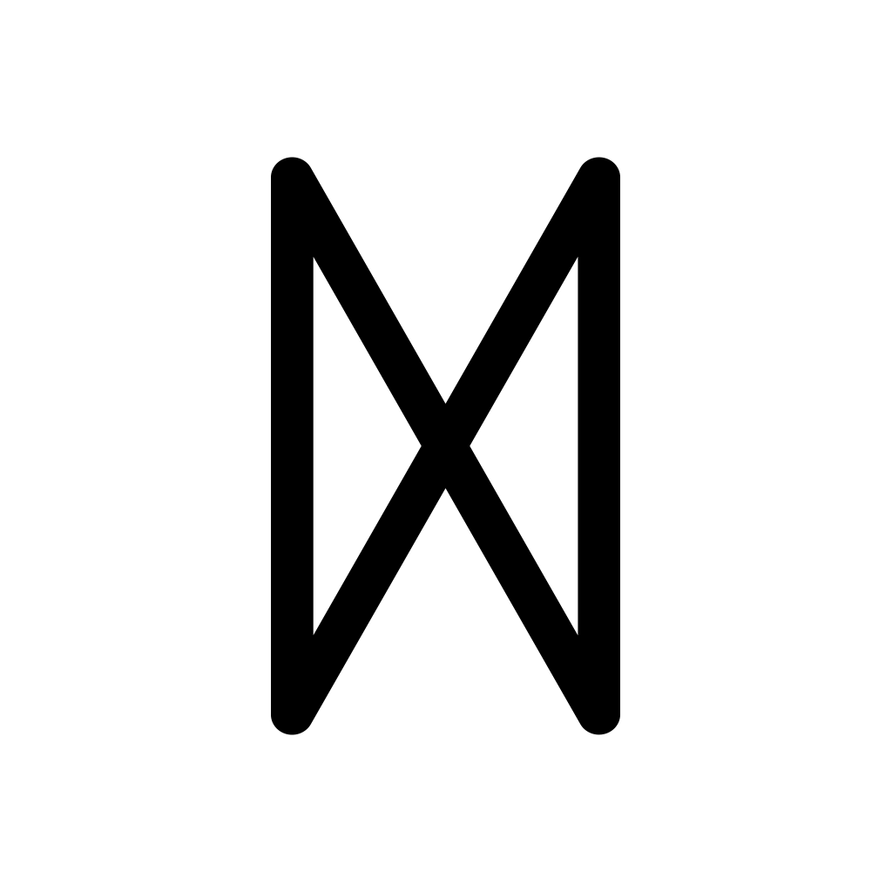
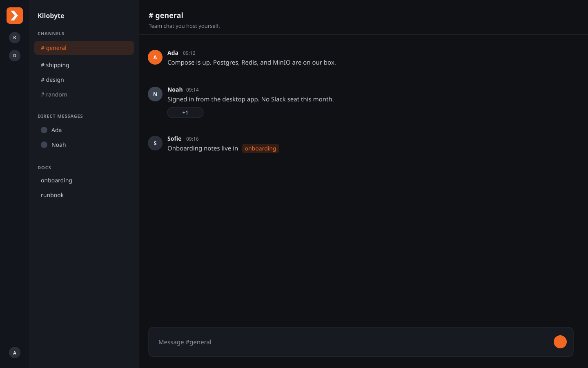

<p align="center">
  
</p>

<h1 align="center">Dagr</h1>

<p align="center">
  Privacy-centric, self-hostable team chat. A Slack alternative you run yourself.
</p>

<p align="center">
  <a href="LICENSE"></a>
  <a href="https://docs.page/kilobyteno/dagr"></a>
  <a href="https://www.dagr.no"></a>
</p>

<p align="center">
  
</p>

*UI is changing during early development, and might not be acurate.*

## Why Dagr

- **Channels and DMs.** Public and private channels, mentions, reactions, and scheduled send.
- **Workspace docs.** A markdown wiki beside chat. Mention pages with `[[slug]]`.
- **Notifications.** In-app inbox and OS alerts, per account and per channel.
- **Incoming webhooks.** Native JSON or Slack-compatible payloads.
- **Cloud or self host.** One Compose file on your infra, or Dagr Cloud when you would rather not run a server.
- **Desktop and web.** macOS, Windows, and the same UI in a browser. Several servers at once.

The project is early. Treat it as something to try, not as production-ready chat yet.

## Try it

Download the macOS or Windows app from [www.dagr.no](https://www.dagr.no). After install, sign in to Dagr Cloud or a server you host.

Self hosted workspaces are not on a plan. History is unlimited. Dagr Cloud is Free (90 days of history) or Pro at €7 per seat.

See [Compare](https://docs.page/kilobyteno/dagr/compare) if you are leaving Slack, Mattermost, Rocket.Chat, Zulip, or Element.

### From source

You need Docker, Node.js 20+, and pnpm. Put a [shadcnblocks](https://www.shadcnblocks.com) Pro key in `client/.env` (see `client/.env.example`) if you change the client UI.

```bash
git clone https://github.com/kilobyteno/dagr.git
cd dagr
make compose-up
```

The API listens on `http://localhost:8383`. The web UI is at `http://localhost:4173`. Check the API with `curl -s http://localhost:8383/api/v1/health`.

```bash
make client-install
make client-dev
```

On login, choose **Self-hosted** and enter `http://localhost:8383`. Create an account and a workspace.

Stop the stack with `make compose-down`.

## More

- [Compare](https://docs.page/kilobyteno/dagr/compare)
- [Quick start](https://docs.page/kilobyteno/dagr/quickstart)
- [Self-hosting](https://docs.page/kilobyteno/dagr/hosting/self-hosting)
- [Contributing](https://docs.page/kilobyteno/dagr/contributing)

## Licence

Apache License 2.0. See [LICENSE](LICENSE).
